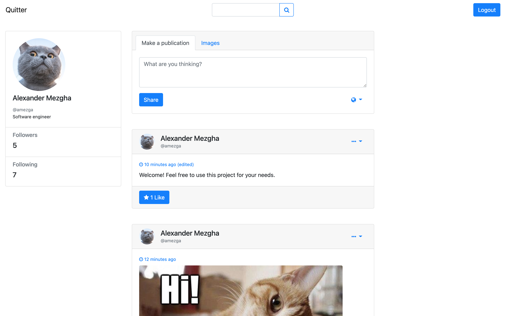

## Social Network Template (Frontend Part)

### Table of content

* **[Overview](#overview)**
* **[Setup](#setup)**
* **[Go to backend](https://github.com/poltavski/social-network-backend)**

### Overview 

This is the Frontend part of the Python implementation of the social network. The [Backend part](https://github.com/poltavski/social-network-backend) is also required for full work.

In this part, the basic functionality of interacting with the server part in a social network is implemented:

* create a user;
* login to the system;
* create a basic post;
* create a post with an image;
* view the feed;
* set the level of access to the post;
* search for people on the net;
* subscribe to other people and view their publications;
* maintaining a session using a JWT token;
* JWT token update;

### Setup 

1. Open terminal in the project folder.
2. Create virtual environment.
   1. `pipenv --python 3.7` or `pipenv --python 3.8`
   2. `pipenv install --dev`

3. Run `main.py` with virtual environment you made above.
4. Setup backend HREF